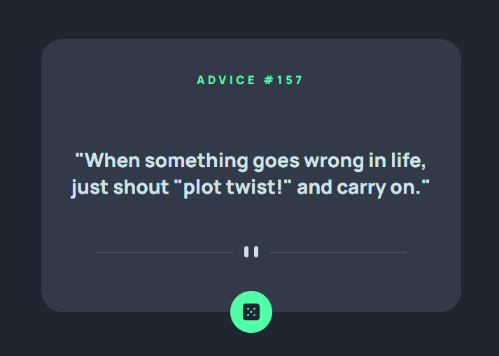
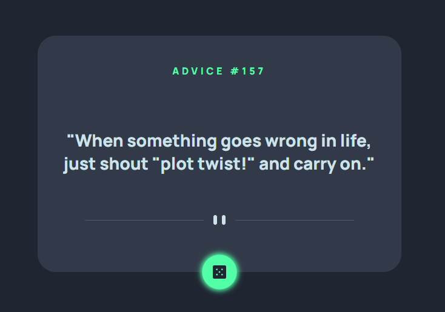
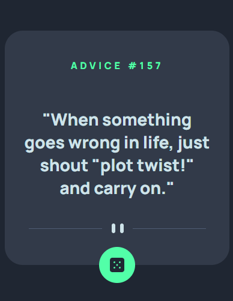

# Frontend Mentor - Advice generator app solution

This is a solution to the [Advice generator app challenge on Frontend Mentor](https://www.frontendmentor.io/challenges/advice-generator-app-QdUG-13db).

## Table of contents

-   [Overview](#overview)
    -   [The challenge](#the-challenge)
    -   [Screenshot](#screenshot)
    -   [Links](#links)
-   [My process](#my-process)
    -   [Built with](#built-with)
    -   [Useful resources](#useful-resources)
-   [Author](#author)

## Overview

### The challenge

Users should be able to:

-   get new advice on button click.

### Screenshot

### Links

-   Solution URL: [Git](https://github.com/ManjeetJass/advice-generator-app.git)
-   Live Site URL: [Git Pages](https://manjeetjass.github.io/advice-generator-app/)

## My process

### Built with

-   Semantic HTML5 markup
-   CSS custom properties
-   CSS Grid
-   Mobile-first workflow
-   Javascript

### Useful resources

-   [Multimedia & Embedding](https://developer.mozilla.org/en-US/docs/Learn/HTML/Multimedia_and_embedding/Responsive_images) - This helped me for selecting image based on screen resolution.
-   [Vertically centering with css](https://codepen.io/kevinpowell/pen/NLEjaz)

## Author

-   Frontend Mentor - [@ManjeetJass](https://www.frontendmentor.io/profile/ManjeetJass)
